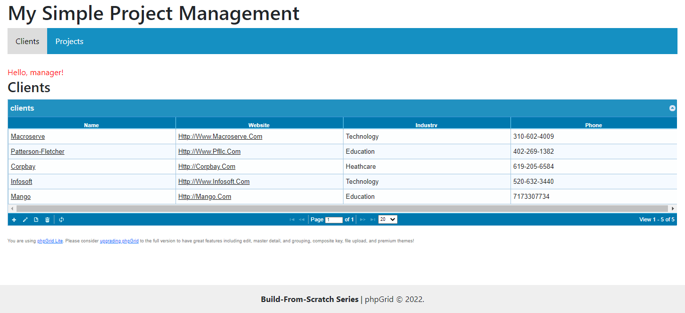
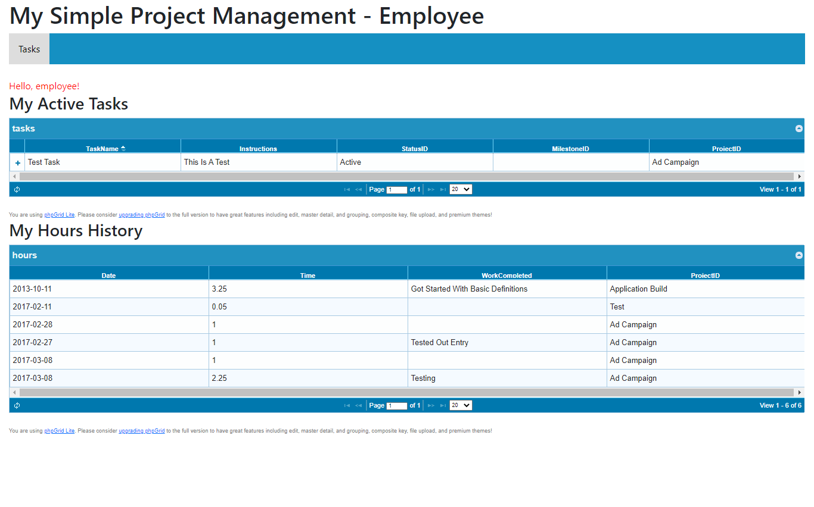

# Proyecto de freecodecamp de [este](https://www.freecodecamp.org/news/build-a-simple-project-management-application-from-scratch-in-php-5c0f886d8560/) enlace: aplicación de administración con PHP y MySQL

1. Creamos el README.md e iniciamos el proyecto con yarn init o npm init (no imprescindible)
2. Creamos la base de datos simple_pm (desde phpmyadmin o por terminal) y las tablas del proyecto cuyo código está [aquí](https://github.com/phpcontrols/phpgrid-project-management/blob/master/db/simple_pm_install.sql) recogido
3. Una vez hecho eso descargamos phpGrid de [aquí](https://phpgrid.com/download/) y extraemos el zip dentro de la carpeta del proyecto, poniéndole phpGrid de nombre
4. Configuramos el archivo conf.php con define(‘PHPGRID_DB_HOSTNAME’, ‘localhost’); define(‘PHPGRID_DB_USERNAME’, ‘root’); define(‘PHPGRID_DB_PASSWORD’, ‘’); define(‘PHPGRID_DB_NAME’, ‘custom_pm’); define(‘PHPGRID_DB_TYPE’, ‘mysql’); -> con los datos que tengamos nosotros de la base de datos creada
5. Pasamos a crear las siguientes carpetas y archivos php:
   - inc (head, menu, footer; que funcionarán como templates para no repetir código)
   - css (un archivo style.css con los estilos correspondientes)
   - manager y employee (para los archivos php de luego)
   - y un template y un index fuera de carpetas, en el directorio principal
6. Introducimos el código correspondiente de los templates de inc y css, así como el de index.php y template.php
7. El siguiente paso es elaborar las páginas principales de Administración, que serán: Clients, Client Details, Projects y Project Details (carpeta manager); donde Clients y Projects serán listas con links a los detalles de los otros dos archivos de la carpeta
8. Después elaboramos el archivo tasks.php (carpeta employee) para la parte de los empleados
9. Ahora tenemos una aplicación funcional de un sistema de administración con clientes, proyectos y tareas listados y detallados
10. Cómo tarea extra, hemos añadido un link a estilos de bootstrap en el head.php y personalizamos un poco el estilo de las tablas
11. Por último, añadimos el proyecto a un repositorio en Github

## Repositorio [Github](https://github.com/phpcontrols/phpgrid-project-management) Original

## Capturas de pantalla

